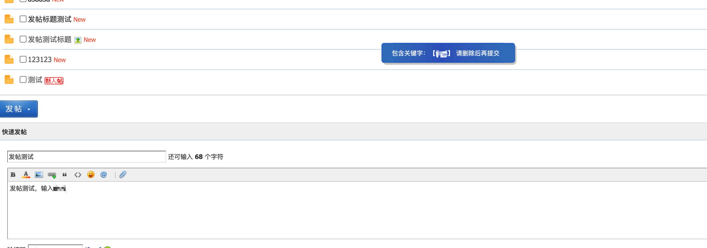
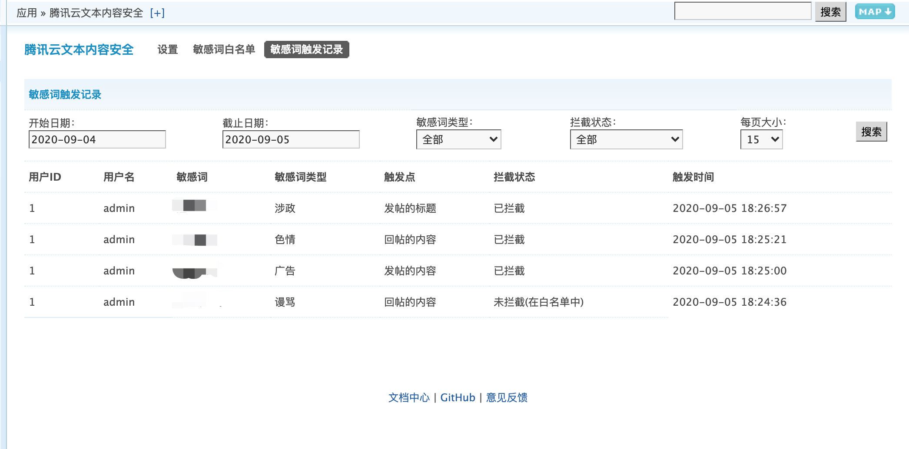
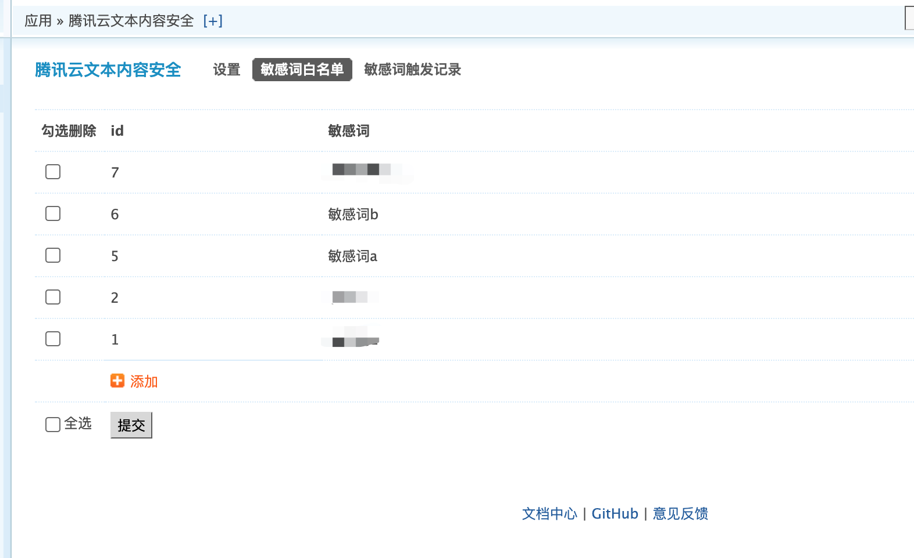
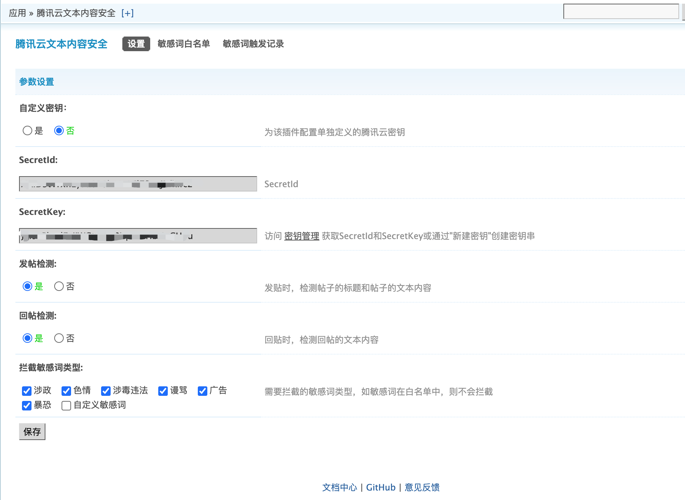

# 腾讯云文本内容安全插件

## 0.版本依赖

- 依赖 PHP 5.5+ 环境

- 如果有其它插件引用了 GuzzleHttp 库并低于 6.3.0 版本会引起插件冲突导致站点无法使用

## 1.插件介绍

> tencentcloud_tms插件是一款腾讯云研发的，提供给DiscuzX站长使用的官方插件。对用户在发帖/回帖场景中提交的内容进行安全审核，识别过滤涉及黄、爆、恐的信息。

| 标题   | 内容                                                      |
| ---- | ------------------------------------------------------- |
| 中文名称 | 腾讯云文本内容安全（TMS）插件                                        |
| 英文名称 | tencentcloud_tms                                        |
| 最新版本 | v1.0.0 (2020.07.08)                                     |
| 适用平台 | [Discuz! X](https://www.discuz.net/forum.php)           |
| 适用产品 | [腾讯云文本内容安全（TMS）](https://cloud.tencent.com/product/tms) |
| 文档中心 | [春雨文档中心](https://openapp.qq.com/docs/DiscuzX/tms.html)  |
| 主创团队 | 腾讯云中小企业产品中心（SMB Product Center of Tencent Cloud）        |

## 2.功能特性

- 对用户在发帖/回帖场景中提交的内容进行安全审核，识别过滤涉及黄、爆、恐的信息。

## 3.安装指引

### 3.1.部署方式一：通过GitHub部署安装

> 1. git clone https://github.com/Tencent-Cloud-Plugins/tencentcloud-discuzx-plugin-tms.git
> 2. 复制 tencentcloud_tms文件夹 到Discuz安装路径/source/plugins/文件夹里面

## 4.使用指引

### 4.1.界面功能介绍

> 对在发帖/回帖场景中提交的文字内容进行检测，检测不通过将会提示如上信息

> 对发帖/回帖场景中拦截的敏感词进行记录展示

> 在白名单中的敏感词将不会拦截

> 后台配置页面。配置介绍请参考下方的[名词解释](#_4-2-名词解释)

### 4.2.名词解释

- **自定义密钥：** 插件提供统一密钥管理，既可在多个腾讯云插件之间共享SecretId和SecretKey，也可为插件配置单独定义的腾讯云密钥。
- **Secret ID：** 在[腾讯云API密钥管理](https://console.cloud.tencent.com/cam/capi)上申请的标识身份的 SecretId。
- **Secret Key：** 在[腾讯云API密钥管理](https://console.cloud.tencent.com/cam/capi)上申请的与SecretId对应的SecretKey。

## 5.获取入口

| 插件入口   | 链接                                                                               |
| ------ | -------------------------------------------------------------------------------- |
| GitHub | [link](https://github.com/Tencent-Cloud-Plugins/tencentcloud-discuzx-plugin-tms) |

## 6.FAQ

> 暂无

## 7.GitHub版本迭代记录

### 7.1 tencentcloud-discuzx-plugin-tms v1.0.0

- 对用户在发帖/回帖场景中提交的内容进行安全审核，识别过滤涉及黄、爆、恐的信息。
###7.2 tencentcloud-discuzx-plugin-tms v1.1.0
- 支持触屏版

---

本项目由腾讯云中小企业产品中心建设和维护，了解与该插件使用相关的更多信息，请访问[春雨文档中心](https://openapp.qq.com/docs/DiscuzX/tms.html) 

请通过[咨询建议](https://support.qq.com/products/164613) 向我们提交宝贵意见。
